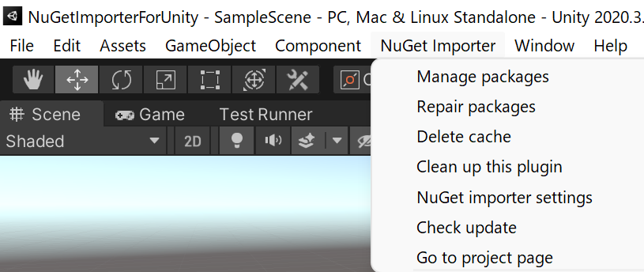
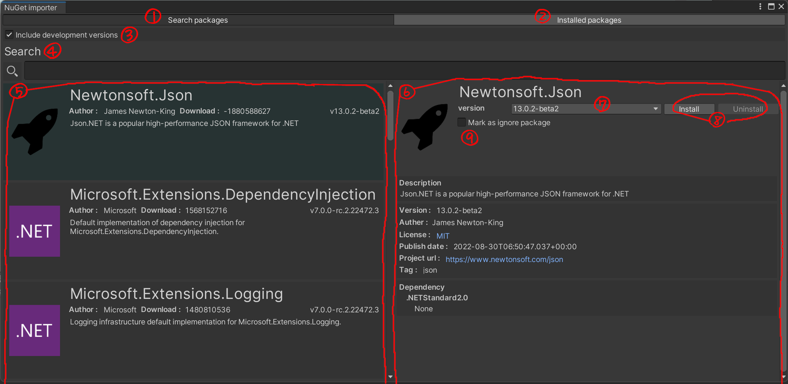
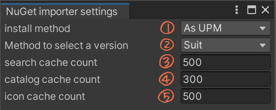

# NuGet importer for Unity
[](https://github.com/kumaS-nu/NuGet-importer-for-Unity/blob/master/NuGetImporterForUnity/Packages/NuGet%20Importer/LICENSE.md)
[](https://github.com/kumaS-nu/NuGet-importer-for-Unity/actions)
[](https://github.com/kumaS-nu/NuGet-importer-for-Unity/releases)
[](https://github.com/kumaS-nu/NuGet-importer-for-Unity/releases)
[](https://www.codefactor.io/repository/github/kumaS-nu/NuGet-importer-for-Unity)
[](https://openupm.com/packages/org.kumas.nuget-importer/)
 
 "NuGet importer for Unity" is a fast, easy-to-use, and powerful editor extension that provides you to import NuGet packages into Unity.
This package also fully supports native plugins.
(This was inspired by [GlitchEnzo/NuGetForUnity](https://github.com/GlitchEnzo/NuGetForUnity), but made from scratch.) 
[日本語はこちら。](README_jp.md) 


## Features

- High performance using asynchronous
- Powerful dependency solving
- Full support for native plugins
- Support for Roslyn Analyzer
- Support for CI/CD
- Useful UI
- UPM and unitypackage support
- Compatible with [GlitchEnzo/NuGetForUnity](https://github.com/GlitchEnzo/NuGetForUnity)

## Usage

### Menu item



- Manage packages ・・・ Open the main window for managing packages.
- Repair packages ・・・ Optimize the dependencies of installed packages and repair them.
- Delete cache ・・・ Delete the cache. (However, the cache is deleted every time the assembly is loaded.)
- Clean up this plugin ・・・ Delete all packages and initialize this plugin.
- NuGet importer settings ・・・ Open the window for configuring settings with NuGet importer.
- Check update ・・・ Check for updates.
- Go to the project page ・・・ Open the "NuGet importer for Unity" web page.

### Main window



1. Mode to search from NuGet.
1. Mode to search from the installed packages.
1. Include the development version or not.
1. Input area for search words. (Incremental search.)
1. Search results.
1. Package details.
1. Version selection.
1. Operations on the package.
1. Ignored package or not.

### NuGet importer settings



1. Specify the installation location. （We recommend using UPM.)
1. Specify the method for determining the package version when solving dependency. (We recommend setting Suit.)
1. Specifies whether check the package is installed at startup. If the package directory exists, NuGet-importer-for-Unity determines as the package is already installed in the project. If NuGet-importer-for-Unity finds missing packages, automatically install them. ( We recommend turning it on.)
1. The maximum number of search results to cache. (0 or less is not cached.)
1. The maximum number of catalogs to cache. (0 or less is not cached.)
1. The maximum number of icons to cache. (0 or less is not cached.)
1. Reduce the amount of data in the communication or not. If on, images of packages not installed in the project will not fetch, and NuGet-importer-for-Unity will not perform package searches until the input has settled.
1. The maximum number of retry attempts to get data when data fetch fails.
1. Time out seconds of communication.
1. List of packages to ignore. The Add button works to append a blank package. The remove button works to remove the last package.

## Configure of .gitignore

You may want to keep installed packages out of git's tracking. In that case, you can add the following to  `.gitignore`. NuGet-importer-for-Unity manages the list of installed packages in `Asset/package.config`, and you can restore packages by sharing this file.
```bash
# NuGet importer
/[Aa]ssets/[Pp]ackages.meta
/[Aa]ssets/[Pp]ackages/

/[Nn]u[Gg]et/

/[Pp]ackages/*/
!/[Pp]ackages/your embedded package to share with git/
```

If you set these packages out of git's tracking, you will get a compile error when you run CI/CD.
Therefore, if you want to use CI/CD with the packages out of git's tracking, you should take one of the following three ways.

- Add `-ignoreCompilerErrors` command line options when launching Unity with batch mode.
- Add `NUGET_PACKAGE_READY` to `Define Constraints` in .asmdef that depends on the installed package.
- Enclose your code that depends on the imported packages in the preprocessor directives below.
    ```csharp
    #if NUGET_PACKAGE_READY

    // your code

    #endif
    ```

## Note

NuGet-importer-for-Unity install files not required at runtime (e.g., rulesets, documentation, etc.) are installed to `(your project)/NuGet`. If you want to reference them, add them reference manually.

When importing this package into your project, this package makes the following changes.
- Turn off `PlayerSettings -> assemblyVersionValidation`. (To make Unity not check the assembly version as NuGet does.)
- Add reference `System.IO.Compression.FileSystem.dll`. (NuGet importer for Unity handles Zip files.)

## License

This package is under [Apache License 2.0](../LICENSE.md).  
Each package in NuGet is governed by the terms included with the package. For more details, see [NuGet F&Q](https://docs.microsoft.com/en-us/nuget/nuget-org/nuget-org-faq#license-terms).