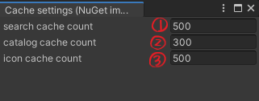

# NuGet importer for Unity

 NuGet importer for Unity は高速で使いやすく、非常に強力に NuGet のパッケージを Unity へ導入できるようにするエディタ拡張です。
また、ネイティブプラグインに対しても完全に対応しております。
（[GlitchEnzo/NuGetForUnity](https://github.com/GlitchEnzo/NuGetForUnity) に影響を受けましたが一から作ってます。）

## 特徴

- 非同期を活用した高速な動作
- 強力な依存関係解決
- ネイティブプラグインに対する完全な対応
- わかりやすいUI
- UPM対応・unitypackageあり
- [GlitchEnzo/NuGetForUnity](https://github.com/GlitchEnzo/NuGetForUnity)との互換性あり

## 使い方

### メニューアイテム

- Manage packages ・・・ パッケージを管理するメインウィンドウを表示する。
- Repair packages ・・・ インストールされているパッケージの依存関係を最適化し、パッケージを修復する。
- Delete cache ・・・ キャッシュを削除する。（ただし、アセンブリがロードされるたびにキャッシュは消えている。）
- Cache settings ・・・ キャッシュに関する設定をするウィンドウを表示する。
- Check update ・・・ 更新があるか確認する。
- Go to project page ・・・ NuGet importer for Unity のページを開く。

### メインウィンドウ

1. NuGet から検索するときのモード。
1. インストールされているものから検索するときのモード。
1. フレームワークの設定。
1. 非安定版も含めるかどうか。
1. 検索語句の入力場所。（インクリメンタルサーチされる。）
1. 検索結果。
1. パッケージの詳細情報。
1. バージョン選択。
1. パッケージに対する操作。

### キャッシュの設定

1. 検索結果のキャッシュする最大数。（0以下はキャッシュしない。）
1. カタログのキャッシュする最大数。（0以下はキャッシュしない。）
1. アイコンのキャッシュする最大数。（0以下はキャッシュしない。）

## ライセンス

これについては、[Apache License 2.0](../LICENSE.md) です。  
NuGet のパッケージについてはそれぞれのライセンスに従います。詳細は [NuGet の F&Q](https://docs.microsoft.com/ja-jp/nuget/nuget-org/nuget-org-faq#license-terms) をご覧ください。